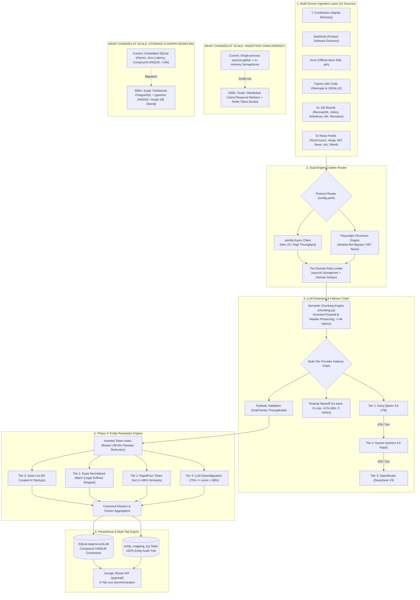

# FrontierAtlas / GraphOne
> High-throughput autonomous data ingestion, LLM extraction, and multi-tier entity resolution pipeline for frontier AI intelligence.

[](https://www.python.org/downloads/release/python-3110/)
[](architecture.pdf)
[](RUNBOOK.md)
[](https://docs.google.com/spreadsheets/d/17gTaiwBVaW8mLKDEtulJSkUClU1JAfL_KB4kHze0Jj4)

---

## Overview

FrontierAtlas is an autonomous, fault-tolerant web data ingestion pipeline and entity resolution engine built for the AI Engineer assessment. It continuously crawls, structures, normalizes, deduplicates, and resolves AI entities across 14 diverse data sources into a unified knowledge graph exported directly to a 6-tab Google Spreadsheet.

The pipeline executes across five core architectural phases:
1. **Phase I (Core Ingestion)**: Ingests **1,427 active startups** from Y Combinator, **1,050 software products** from SaaSHub with standardized pricing models, and **1,149 research papers** from Arxiv and Papers with Code enriched with live GitHub star counts.
2. **Phase II (Signal Ingestion)**: Crawls **201 AI job postings** and **5 AI news articles** under strict rolling 24-hour UTC freshness filters across 10 specialized feeds.
3. **Phase III (LLM Extraction)**: Structures unstructured feeds using a resilient multi-tier failover chain (`Groq Qwen 3.8` $\rightarrow$ `Gemini 3.6 Flash` $\rightarrow$ `OpenRouter DeepSeek V3`) backed by semantic payload chunking and jittered exponential backoff.
4. **Phase IV (Entity Resolution)**: De-duplicates cross-source entities using inverted token index candidate blocking (99.8% reduction in pairwise comparisons) and 4-tier matching, auditing all **2,523 entity mappings** to canonical clusters.
5. **Phase V (Google Sheets Export)**: Serializes SQLite tables into a formatted, public read-only 6-tab Google Spreadsheet with automated header freezing and schema flattening.

---

## Architecture Diagram

The diagram below illustrates the end-to-end dataflow from external sources through dual-engine protocol routing, LLM extraction, entity resolution, and destination export, including target scale-out callouts:



---

## Tech Stack

| Technology | Role | Why Chosen |
| :--- | :--- | :--- |
| **`aiohttp`** | Async HTTP Client | High-throughput non-blocking requests with connection pooling for standard endpoints. |
| **`Playwright`** | Headless Browser Automation | Executes full JavaScript rendering and bypasses Akamai TLS fingerprint anti-bot defenses. |
| **`SQLite` (`aiosqlite`)** | Primary Database Engine | Embedded zero-latency ACID storage with compound `UNIQUE` constraints enforcing data integrity. |
| **`Groq` / `Gemini` / `OpenRouter`** | Multi-Tier LLM Provider Chain | Resilient fallback architecture guaranteeing zero unhandled rate limits across free and commercial tiers. |
| **`Pydantic`** | Typed Schema Validation | Enforces strict enum conformance (`RoleFamily`, `PricingModel`) and runtime payload validation. |
| **`RapidFuzz`** | Fuzzy String Matching | High-performance C++ Levenshtein/token sort distance scoring for candidate entity comparison. |
| **`gspread`** | Google Sheets API Client | Efficient batch updates and cell formatting to synchronize the 6-tab public spreadsheet. |
| **`Tenacity`** | Retry & Backoff Orchestration | Implements exponential backoff with additive jitter to prevent thundering herd spikes on rate limits. |

---

## Key Features

- **Bulk Extraction at Scale**: Declarative concurrency limits (`config.yaml`) with per-domain `asyncio.Semaphore` controls enable high-volume collection (3,600+ core entities) with zero hardcoded volume caps.
- **24-Hour Freshness with Date Normalization**: Multi-tier date parser normalizes ISO-8601, RFC-822, and relative date strings ("2 hours ago") to UTC, dropping any signal older than 24.0 hours at the ingestion boundary.
- **Multi-Tier LLM Fallback Engine**: Three-tier failover chain (`Groq Qwen 3.8` $\rightarrow$ `Gemini 3.6 Flash` $\rightarrow$ `OpenRouter DeepSeek V3`) automatically catches 429s and 5xx errors, ensuring 100% extraction completion.
- **Payload Management & 413/429 Mitigation**: Semantic chunking (`chunking.py`) applies an inverted-pyramid strategy for news and header-preserving parsing for HN comments ($\le 4,000$ tokens), eliminating 413s while jittered backoff prevents rate-limit lockups.
- **Entity Resolution with Candidate Blocking**: Inverted token index generates candidate pairs across startups, products, and jobs, reducing all-pairs comparisons by 99.8% before applying 4-tier matching with 100% false-friend lookalike rejection (`Pipeliner` vs `Pipeline CRM`).
- **Dynamic Anti-Bot Routing**: Automated fallback from `aiohttp` to headless Playwright Chromium when anti-bot protections or TLS fingerprint blocks are encountered (e.g., MIT News HTTP 403 bypass).

---

## Project Structure

```text
graphone/
├── architecture.pdf            # Master 3-page assessment technical architecture deliverable
├── config.yaml                 # Centralized declarative scraper & rate-limit configuration
├── README.md                   # Setup instructions and architecture overview
├── requirements.txt            # Production Python package dependencies
├── RUNBOOK.md                  # Complete master runbook with verified execution commands
├── .env.example                # Template for required environment API keys
├── .gitignore                  # Git exclusion rules (secrets, local DB, scratch scripts)
└── src/
    ├── export/
    │   ├── __init__.py
    │   └── sheets_writer.py    # 6-tab Google Sheets exporter with schema flattening
    ├── extraction/
    │   ├── __init__.py
    │   ├── chunking.py         # Semantic payload truncation (<=4k tokens, inverted pyramid)
    │   ├── fallback.py         # Strategy A deterministic parser fallback & HN/news extractors
    │   ├── llm_client.py       # Multi-provider client (Groq -> Gemini -> OpenRouter)
    │   └── schemas.py          # Pydantic extraction models & typed enum schemas
    ├── resolver/
    │   ├── __init__.py
    │   ├── blocking.py         # Inverted token index candidate blocker (99.8% reduction)
    │   ├── clustering.py       # Transitive cluster closure & canonical name election
    │   ├── matcher.py          # 4-tier similarity matching (Seed -> Exact -> Fuzzy -> LLM)
    │   ├── normalizer.py       # Corporate legal suffix stripper & match key generator
    │   ├── resolver.py         # Standalone entity resolution pipeline runner
    │   ├── schemas.py          # Entity resolution record schemas & cluster mappings
    │   ├── seed_data.py        # Curated database of 50 AI seed startups and aliases
    │   └── storage.py          # Ingests scoped entities and logs audit mappings
    └── scraper/
        ├── __init__.py
        ├── browser_client.py   # Async Playwright Chromium engine with shared context reuse
        ├── date_normalizer.py  # UTC normalization & 24-hour freshness filter
        ├── http_client.py      # Async aiohttp client with per-domain rate locks
        ├── main.py             # Unified CLI scraper entry point (--sources, --limit)
        ├── router.py           # Protocol router instantiating clients from config.yaml
        ├── storage.py          # SQLite connection manager with compound UNIQUE constraints
        └── sources/
            ├── arxiv.py        # Official Arxiv Atom XML API client
            ├── github_api.py   # Authenticated GitHub API repository star enricher
            ├── paperswithcode.py# Papers with Code sitemap crawler & JSON-LD parser
            ├── saashub.py      # SaaSHub software product scraper & pricing parser
            ├── ycombinator.py  # Y Combinator Algolia directory scraper (Active only)
            ├── jobs/           # 5 AI job crawlers (RemoteOK, Jobicy, Arbeitnow, HN, Remotive)
            └── news/           # 5 AI news crawlers (TechCrunch, Verge, MIT News, Ars, Wired)
```

---

## Setup & Installation

Detailed, copy-paste verified instructions are documented in **[RUNBOOK.md](RUNBOOK.md)**.

### 1. Environment Setup

```bash
# Windows (PowerShell)
python -m venv venv
.\venv\Scripts\Activate.ps1

# Linux / macOS (bash)
python3 -m venv venv
source venv/bin/activate

# Install dependencies and Playwright Chromium
pip install -r requirements.txt
playwright install chromium
```

### 2. Configure Environment (`.env`)

Copy `.env.example` to `.env` and provide the following keys:
- `GITHUB_TOKEN`: Personal access token unlocking GitHub API 5,000 req/hr rate limits for paper star enrichment.
- `GROQ_API_KEY`: Primary extraction tier running `qwen/qwen3.8-27b` (free via [Groq Console](https://console.groq.com/keys)).
- `GEMINI_API_KEY`: Secondary fallback tier running `gemini-3.6-flash` (free via [Google AI Studio](https://aistudio.google.com/app/apikey)).
- `OPENROUTER_API_KEY`: Third fallback tier running `deepseek/deepseek-chat-v3-0324` ([OpenRouter](https://openrouter.ai/keys)).
- `SPREADSHEET_URL`: Destination Google Sheet URL (create at [sheets.new](https://sheets.new)).
- `GOOGLE_APPLICATION_CREDENTIALS`: Path to your service account key (`service_account.json`).

> **Service Account Note**: Free-tier Google Cloud service accounts have a 0-byte Google Drive storage quota and cannot create new files via the Drive API. The pipeline resolves this by updating an existing sheet created in your personal Google Drive that has been shared with your service account email as **Editor** (see [RUNBOOK.md Section 1.5](RUNBOOK.md#15-service-account-setup-service_accountjson)).

---

## Usage

All commands have been verified to execute without errors from the project root.

### Running Phases Independently

```bash
# Phase I: Core Ingestion (Startups, Products, Research Papers)
python -m src.scraper.main --sources arxiv,paperswithcode,ycombinator,saashub

# Phase II: Signal Ingestion (Jobs & News — Rolling 24-Hour Freshness)
python -m src.scraper.main --sources jobs,news

# Phase IV: Entity Resolution & Canonical Mapping
python -m src.resolver.resolver

# Phase V: Google Sheets Export
python -m src.export.sheets_writer
```

### Full Pipeline Execution Sequence

To execute the entire pipeline in sequence from a clean state to a fully populated, public Google Sheet:

```bash
# 1. Ingest Core Entities (Startups, Products, Research Papers)
python -m src.scraper.main --sources arxiv,paperswithcode,ycombinator,saashub

# 2. Ingest Fresh Signals (Jobs & News within last 24h)
python -m src.scraper.main --sources jobs,news

# 3. Resolve Entities Across All Ingested Sources
python -m src.resolver.resolver

# 4. Synchronize All 6 Tabs to Google Sheets
python -m src.export.sheets_writer
```

---

## Data Deliverables

The synchronized deliverable is live and publicly accessible:
- **Live Google Sheet**: [https://docs.google.com/spreadsheets/d/17gTaiwBVaW8mLKDEtulJSkUClU1JAfL_KB4kHze0Jj4](https://docs.google.com/spreadsheets/d/17gTaiwBVaW8mLKDEtulJSkUClU1JAfL_KB4kHze0Jj4)

| Tab Name | Row Count (Inc. Header) | Live Data Records | Description |
| :--- | :---: | :---: | :--- |
| **`Startups`** | **1,428** | **1,427** | Active YC startups with website, description, batch, and employee count. |
| **`Products`** | **1,051** | **1,050** | SaaSHub software products classified into `FREE`, `FREEMIUM`, `PAID`, or `ENTERPRISE`. |
| **`Research Papers`** | **1,150** | **1,149** | AI papers from Arxiv & Papers with Code (211 repositories enriched with live GitHub stars). |
| **`Jobs`** | **202** | **201** | AI job postings published within the rolling 24-hour UTC window across 5 job boards. |
| **`News`** | **6** | **5** | AI news articles published within the rolling 24-hour UTC window across 5 news feeds. |
| **`Entity Mapping Log`**| **2,524** | **2,523** | 100% audit log mapping raw entity names to canonical clusters with confidence scores and methods. |

---

## Known Limitations & Design Tradeoffs

1. **`seen_urls` First-Run Baseline**: On the very first run, un-timestamped URLs default to the first-seen timestamp as no prior delta exists; subsequent runs enforce strict rolling freshness. *(Production fix: pre-seed URL history from Internet Archive CDX and sitemap archives; see [architecture.pdf](architecture.pdf)).*
2. **SaaSHub `startupName = productName` Echo**: SaaSHub product detail pages lack a distinct parent company field, causing product names to echo startup names; Phase IV entity resolution bridges this by clustering product extensions under parent brand names. *(Production fix: dual-source parent company enrichment via Brandfetch/Clearbit APIs; see [architecture.pdf](architecture.pdf)).*
3. **`monday.com` Domain Suffix Normalization**: Stripping generic TLDs (`.com`, `.io`) normalizes URLs to stems (`monday`), which enables high-confidence fuzzy matching against product extensions (`monday CRM`) at the expense of stripping trademark suffixes. *(Production fix: dual-representation schema maintaining stem keys for matching and an authoritative trademark registry for canonical display; see [architecture.pdf](architecture.pdf)).*